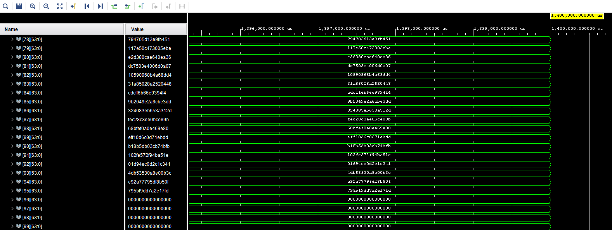

# EXPONENTIATION MODULAIRE : IMPLEMENTATION VHDL

### VALIDATION FONCTIONNELLE DU DESIGN

L'outil en ligne [Magma calculator](magma.maths.usyd.edu.au/calc/) a été utilisé pour générer les paramètres utiles nécessaires à l'exécution de la multiplication de Montgomery.
Ceux-ci ne sont pas générés par l'implémentation. Il a également permis de vérifier les algorithmes utilisés et fournis des résultats intermédiaire à des fins de validation. Le code suivant a été utilisé :

Le fichier magma.txt contient le code du projet.

Des simulations fonctionnelles ont permis de vérifier le design. Celui-ci peut calculer une exponentiation modulaire en environ **1336 ms**. 

En partant des paramètres générés, notre implémentation a su calculer le même résultat que celui donné par la fonction Modexp de Magma calculator.
La donnée de résultat est stockée dans les registres 80 à 95 par ordre de bits de poids faibles.
